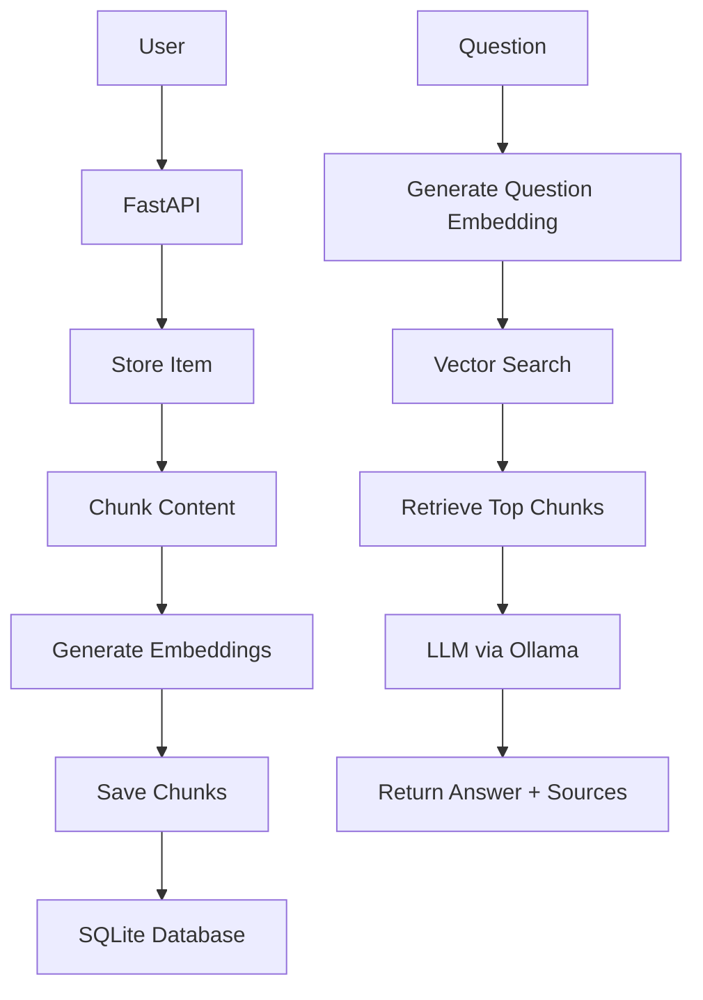

# AI Knowledge Inbox

<p align="center">
  
  
  
  
</p>

AI Knowledge Inbox is a production-style Retrieval-Augmented Generation (RAG) application that helps users store notes or webpage URLs, automatically process and index their content, and ask natural-language questions over a personal knowledge base.

The system uses semantic search with vector embeddings and an LLM to retrieve relevant context and generate answers with source citations.

## ✨ Features

### Knowledge Ingestion
- Add text notes
- Add website URLs
- Fetch and extract readable webpage content
- Preserve original source information
- Store creation timestamps
- Generate AI-based titles and summaries

### Knowledge Processing
- Intelligent chunking with overlap
- Batch embedding generation
- Vector-based semantic indexing

### Semantic Question Answering
- Generate embeddings for user questions
- Retrieve the most relevant chunks using cosine similarity
- Answer questions using retrieved context only
- Return source citations and snippets

### API Capabilities
- POST /ingest
- GET /items
- POST /query
- Pagination support
- Validation and proper HTTP status handling

---

## 🛠️ Tech Stack

| Layer | Technologies |
| --- | --- |
| Backend | FastAPI, Python, SQLAlchemy, SQLite, Pydantic |
| AI | Ollama, llama3.2, nomic-embed-text |
| Web Processing | BeautifulSoup4, httpx |
| Vector Search | Scikit-learn cosine similarity |
| Frontend | React, Vite |

---

## 🏗️ Architecture

The application follows a simple yet scalable RAG pipeline:



---

## 📁 Project Structure

```text
app/
├── db/
│   └── database.py
├── models/
│   ├── chunk.py
│   └── item.py
├── routes/
│   ├── item.py
│   └── query.py
├── schemas/
│   ├── item.py
│   └── query.py
├── services/
│   ├── chunk_service.py
│   ├── embedding_service.py
│   ├── item_service.py
│   ├── llm_service.py
│   ├── query_service.py
│   ├── url_service.py
│   └── vector_service.py
├── main.py
```

### Folder Responsibilities
- app/db/: Database configuration and session management
- app/models/: SQLAlchemy models for items and chunks
- app/schemas/: Pydantic request and response models
- app/routes/: FastAPI endpoint definitions
- app/services/: Business logic for ingestion, embeddings, retrieval, and LLM interactions
- main.py: Application entry point and router registration

---

## 🚀 Installation

### 1. Clone the repository

```bash
git clone <repository-url>
cd ai-knowledge-inbox
```

### 2. Create and activate a virtual environment

On Windows PowerShell:

```powershell
python -m venv .venv
.\.venv\Scripts\Activate.ps1
```

### 3. Install Python dependencies

```bash
pip install -r requirements.txt
```

### 4. Start Ollama

Make sure Ollama is installed and running locally.

```bash
ollama pull llama3.2
ollama pull nomic-embed-text
ollama serve
```

### 5. Run the FastAPI backend

```bash
uvicorn main:app --reload
```

The API will be available at:
- http://127.0.0.1:8000/docs
- http://127.0.0.1:8000/redoc

### 6. Run the React frontend (optional)

```bash
npm install
npm run dev
```

---

## 📚 API Documentation

### POST /ingest

Ingest either a text note or a URL.

#### Request Example: Text

```json
{
  "source_type": "text",
  "content": "FastAPI is a modern Python web framework for building APIs."
}
```

#### Request Example: URL

```json
{
  "source_type": "url",
  "content": "https://example.com"
}
```

#### Example Response

```json
{
  "id": 1,
  "source_type": "text",
  "original_source": null,
  "title": "FastAPI Overview",
  "summary": "A concise explanation of FastAPI and its strengths.",
  "content": "FastAPI is a modern Python web framework for building APIs.",
  "created_at": "2026-08-01T12:00:00"
}
```

### GET /items

Retrieve ingested knowledge items with pagination.

#### Example

```bash
GET /items?page=1&limit=9
```

#### Example Response

```json
[
  {
    "id": 1,
    "source_type": "url",
    "original_source": "https://example.com",
    "title": "Example Article",
    "summary": "A short summary of the article.",
    "content": "The full article content is stored here.",
    "created_at": "2026-08-01T12:00:00"
  }
]
```

### POST /query

Ask a natural language question over your indexed knowledge base.

#### Example Request

```json
{
  "question": "What is FastAPI used for?"
}
```

#### Example Response

```json
{
  "answer": "FastAPI is used for building modern web APIs in Python.",
  "sources": [
    {
      "source_type": "text",
      "original_source": null,
      "created_at": "2026-08-01T12:00:00",
      "snippet": "FastAPI is a modern Python web framework for building APIs..."
    }
  ]
}
```

---

## ⚙️ Environment Requirements

- Python 3.10+
- Node.js 18+
- Ollama installed and running
- SQLite available by default with Python

---

## ⚠️ Error Handling

The API returns meaningful error responses for common issues:

- Invalid URL format
- Empty content submissions
- Connection timeouts when fetching a website
- Ollama service unavailable
- No knowledge found in the database
- No relevant context found for a question

These errors are returned with appropriate HTTP status codes such as 400, 408, 404, and 503.

---


